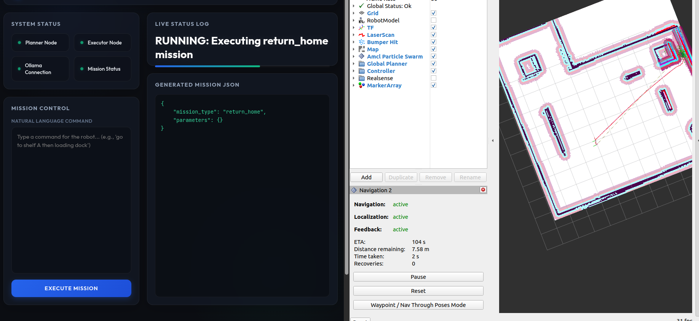
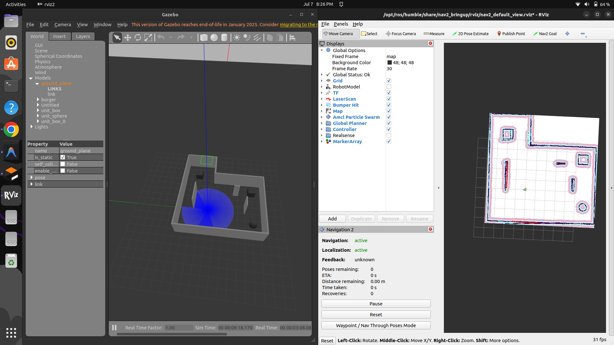

# ROS 2 LLM-Powered Warehouse Robot Simulation



A ROS 2-based warehouse simulation featuring a TurtleBot3 robot, autonomous navigation via Nav2 (AMCL localization), and natural language mission planning powered by a local Ollama instance running Qwen2.5.

## System Architecture



```
                                  [ Flask Web Interface ]
                                             │  ▲
                            /user_prompt (pub)│  │ /mission_status & /mission_request (sub)
                                             ▼  │
[ Natural Language Command ] ──> [ Mission Planner (Ollama + Qwen2.5) ]
                                             │
                                             ▼ /mission_request (JSON)
                                 [ Mission Validator ]
                                             │ (Validates schema & limits)
                                             ▼
                                  [ Mission Executor ]
                                             │
                                             ▼ Nav2 Action Server
                                    [ Nav2 Navigation ]
                                             │
                                             ▼ Cmd Vel
                                  [ Gazebo TurtleBot3 ]
```

---

## Prerequisites

1. **ROS 2 Humble** installed on Ubuntu 22.04.
2. **Nav2 & TurtleBot3 packages** installed:
   ```bash
   sudo apt update
   sudo apt install ros-humble-navigation2 ros-humble-nav2-bringup
   sudo apt install ros-humble-turtlebot3-gazebo ros-humble-turtlebot3-teleop
   ```
3. **Ollama** installed locally:
   - Follow instructions on [ollama.ai](https://ollama.ai/)
   - Pull the Qwen2.5 7B model:
     ```bash
     ollama pull qwen2.5:7b
     ```
4. **Python dependencies** installed:
   ```bash
   pip install -r requirements.txt
   ```

---

## Build & Setup

1. **Clone the repository**:
   ```bash
   git clone https://github.com/joshies-cpu/Ros2-LLM-Warehouse-sim.git
   cd Ros2-LLM-Warehouse-sim
   ```

2. **Build the workspace**:
   ```bash
   colcon build
   source install/setup.bash
   ```

---

## Running the Project

### 1. Launch the Backend
Launch the entire Gazebo simulation, Nav2 bringup, RViz, and background mission nodes (Executor & Planner) in one command:
```bash
ros2 launch warehouse_sim all_in_one.launch.py
```

### 2. Launch the Web Interface
In a separate terminal, source the workspace and start the Flask server:
```bash
source install/setup.bash
python3 web_interface/app.py
```

### 3. Open the Dashboard
Open your web browser and navigate to:
[http://localhost:5000](http://localhost:5000)

---

## Features

- **Dynamic Connection Status**: Live checking of active ROS 2 nodes (`mission_planner`, `mission_executor`) and the Ollama server API.
- **Server-Sent Events (SSE)**: Stream status updates (`/mission_status`) and generated JSON (`/mission_request`) dynamically without page reloads.
- **Modern Dark Theme**: Professional dashboard utilizing glassmorphism and clean indicators.
